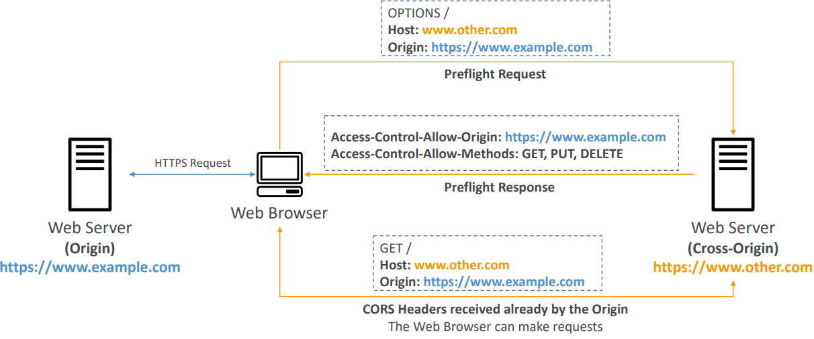
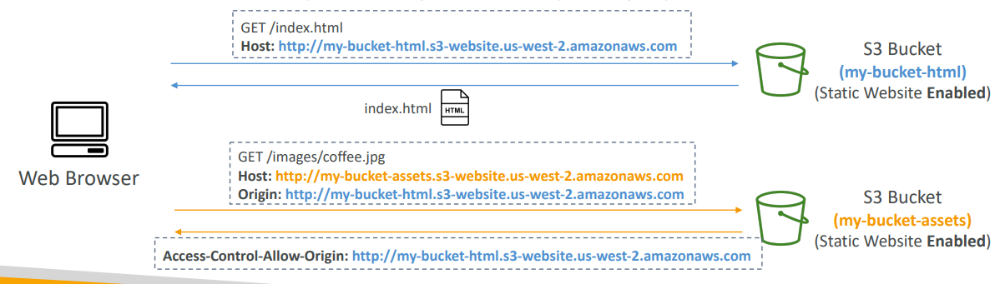

# CORS (Cross-Origin Resource Sharing)

- Cross-Origin Resource Sharing (CORS)
- Origin = scheme (protocol) + host (domain) + port
  - example: https://www.example.com (implied port is 443 for HTTPS, 80 for HTTP)
- Web Browser based mechanism to allow requests to other origins while visiting the main origin
- Same origin: `http://example.com`/app1 & `http://example.com`/app2 (same protocol, domain, port)
- Different origins: `http://www.example.com` & `http://other.example.com`
- The requests won’t be fulfilled unless the other origin allows for the requests, using CORS Headers (example: Access-Control-Allow-Origin)

## How it works

## S3 CORS Configuration

- If a client makes a cross-origin request on our S3 bucket, we need to enable
  the correct CORS headers
- It’s a popular exam question
- You can allow for a specific origin or for \* (all origins)
  
