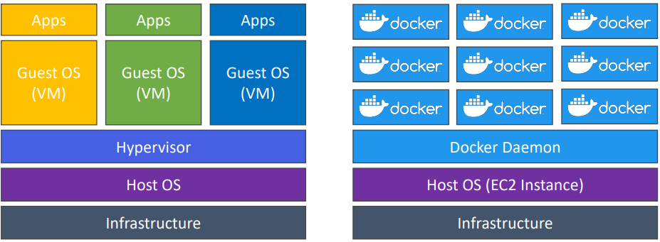

# Docker

- Docker is a software development platform to deploy apps
- Apps are packaged in containers that can be run on any OS
- Apps run the same, regardless of where they’re run
  - Any machine
  - No compatibility issues
  - Predictable behavior
  - Less work
  - Easier to maintain and deploy
  - Works with any language, any OS, any technology
- Use cases: microservices architecture, lift-and-shift apps from on- premises to the AWS cloud, etc.

## Docker Images

- Docker images are stored in Docker Repositories
- Docker Hub (https://hub.docker.com)
  - Public repository
  - Find base images for many technologies or OS (e.g., Ubuntu, MySQL, etc.)
- Amazon ECR (Amazon Elastic Container Registry)
  - Private repository
  - Public repository (Amazon ECR Public Gallery https://gallery.ecr.aws)

## Docker vs Virtual Machines

• Docker is ”sort of” a virtualization technology, but not exactly
• Resources are shared with the host => many containers on one server

## Getting Started with Docker

- **Dockerfile**: text file with instructions to build a Docker image
  > Build >
- **Docker Image**: executable package with everything needed to run an application
  > Push/Pull >
- **Docker Repository**: storage for Docker images (e.g., Docker Hub, Amazon ECR)
  > Run >
- **Docker Container**: running instance of a Docker image
  > Stop/Start/Restart >
- **Docker CLI**: command line interface to interact with Docker

## Docker Container Management on AWS

- **Amazon ECS (Elastic Container Service)**:
  - Amazon’s own container platform
- **Amazon Elastic Kubernetes Service (Amazon EKS)**:
  - Amazon’s managed Kubernetes (open source)
- **AWS Fargate**:
  - Amazon’s own Serverless container platform
  - Works with ECS and with EKS
- **Amazon ECR (Elastic Container Registry)**:
  - Store container images
